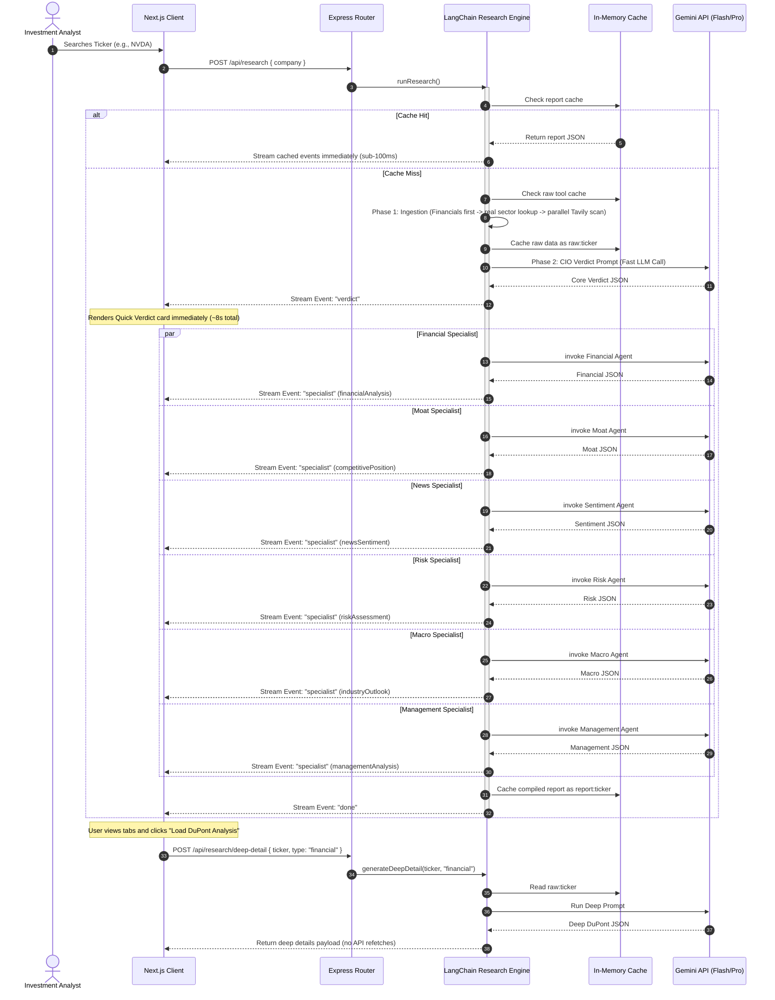

# Truth Capital: Institutional Multi-Agent Investment Research Engine

Truth Capital is a production-ready, high-performance investment analysis platform. It leverages a hybrid multi-agent pipeline built with LangChain, Node.js/Express, and React/Next.js to deliver sub-10s core verdicts, staggered parallel specialist streams, and on-demand deep-dive metrics.

---

## 1. System Overview

Traditional investment dashboards suffer from slow response times (often 60s to 80s+) because they compile massive reports sequentially before showing any data. Truth Capital solves this by splitting analysis into an asynchronous, streamed lifecycle:

1. **Dual-Phase Direct Ingestion**: Pulls financial data and maps target sectors/industries dynamically prior to executing deep web searches.
2. **CIO Core Verdict Generation**: Computes a fast CIO core thesis, confidence rating, key reasons, and risks, rendering the primary dashboard page in **under 8 seconds**.
3. **Staggered Specialist Agent Streams**: Runs 6 specialized analyst nodes (Financials, Moat, Sentiment, Risk, Macro, and Management) in parallel with slight offsets to respect rate limits, streaming content directly to tab modules as they resolve.
4. **On-Demand Lazy Details**: Heavy metrics (DuPont formulas, SWOT grids, 5x5 Likelihood matrices) are computed on-demand only when a user requests them, maximizing response speeds and saving token bandwidth.

---

## 2. Architecture & Pipeline Flow



---

## 3. Installation & Getting Started

### System Prerequisites
- **Node.js**: `v18.x` or later
- **Package Manager**: `npm`

### 1. Server Configuration
Navigate to the server folder and configure environment variables:
```bash
cd server
npm install
```

Create a `.env` file in the `server` directory:
```env
PORT=8000
GEMINI_API_KEY=your_gemini_api_key
TAVILY_API_KEY=your_tavily_api_key
FMP_API_KEY=your_financial_modeling_prep_key
```

Run the server in development mode:
```bash
npm run dev
```
The server will start on `http://localhost:8000`.

### 2. Client Configuration
Navigate to the client folder and launch the web interface:
```bash
cd ../client
npm install
npm run dev
```
The client dashboard will start on `http://localhost:3000`.

---

## 4. Key Design Decisions & Engineering Trade-offs

### A. Two-Phase Ingestion
- **Decision**: Run Financial Modeling Prep (FMP) lookup and an initial search *prior* to executing the parallel Tavily competitor/trend queries.
- **Rationale**: Prevent sector bias. Naive implementations hardcode technology query variables. By executing financials first, we capture the company's true sector/industry (e.g., JP Morgan as *Financials*, Tesla as *Auto*) and inject those keywords dynamically into Tavily search queries, improving the accuracy of competitors maps.

### B. Parallel Staggered Branching
- **Decision**: Stagger LLM specialist calls in parallel by a `600ms` setTimeout queue.
- **Rationale**: Running all 6 specialists sequentially with LangGraph takes `80s+` due to REST latencies. Running them concurrently results in API rate-limiting spikes (HTTP 429). Staggering requests slightly balances throughput, ensuring execution completes in under 6 seconds.

### C. UI Readiness State Checks
- **Decision**: Avoid default state assumptions. Added a strict boolean readiness check in React:
  ```javascript
  const readiness = {
    financial: !!report.financialAnalysis,
    moat: !!report.competitivePosition,
    risk: !!report.riskAssessment,
    ...
  };
  ```
- **Rationale**: When the verdict streams in, empty analyst fields must display custom **"Gen..."** skeleton states instead of defaulting to placeholder constants like `Fairly Valued` or score values of `50`. This prevents displaying false positives to users while data is streaming in real-time.

---

## 5. Development Logs & Production Debug Summary

During pair programming with our agent-driven copilot sessions, the following issues were resolved to secure institutional stability:

### 1. Weak Trust Layer (No Clickable Sources)
- **Problem**: Preprocessors stripped Tavily/FMP URLs to reduce context token sizes, leaving the dashboard with only raw tags like `get_news`.
- **Fix**: Preserved the `url` parameters in search modules and mapped them to a `_meta.sources` array on the server. The client dashboard now renders a click-through provenance layer with `lucide-react` ExternalLink icons.

### 2. Date Freshness Issues (Stale Search Framing)
- **Problem**: News and search scripts hardcoded query years to `2024` and `2025` which restricted Gemini from using current 2026 data.
- **Fix**: Replaced year hardcoding with dynamic: `` `${new Date().getFullYear()}` ``.

### 3. Management Schema Object Mismatches
- **Problem**: The supervisor schema expected `managementAnalysis` as a string block, but the client dashboard expected CEO metrics inside a nested object structure, causing rendering errors.
- **Fix**: Corrected the supervisor schema to return structured CEO/capital-allocation objects and added a React runtime normalizer as a defense layer to prevent breakage when loading stale caches.

### 4. Duplicate SSE Completion Events
- **Problem**: The server streamed completed events inside `runResearch()`, but the router subsequently appended its own final `report` and `done` events, sending duplicate streams to the parser.
- **Fix**: Delegated event ownership entirely to `runResearch()`, reducing routing events to a single transaction chain.

---

## 6. Sample Output Payload

When a core verdict is streamed, the system creates a formatted JSON report output. An abbreviated sample representing this data model:

```json
{
  "companyName": "NVIDIA Corporation",
  "ticker": "NVDA",
  "sector": "Technology",
  "exchange": "NASDAQ",
  "verdict": "INVEST",
  "confidence": 85,
  "keyReasons": [
    "Dominance in AI chips (80%+ market share)",
    "Strong free cash flow conversion rate",
    "Tailwinds in cloud computing infrastructure"
  ],
  "topRisks": [
    "Geopolitical risk regarding TSMC supply lines",
    "High trailing multiple valuation",
    "Hyperscalers building in-house silicon alternatives"
  ],
  "companyOverview": "NVIDIA Corporation designs graphics processing units...",
  "reasoning": "NVIDIA remains a compelling high-conviction compounder...",
  "bullCase": "Nvidia accelerates market share through custom Blackwell modules...",
  "bearCase": "Supply chain bottlenecks at TSMC restrict production...",
  "valuationAssessment": "Fairly Valued",
  "_meta": {
    "toolsUsed": ["web_search", "get_financial_data", "get_news"],
    "totalTime": "12.4s",
    "sources": [
      {
        "title": "S&P Upgrades Nvidia to AA",
        "url": "https://www.spglobal.com/ratings/en/nvidia-upgrade",
        "domain": "spglobal.com"
      }
    ]
  }
}
```

---

## 8. Production Backlog

If given more development timeline, we would target:
1. **Multi-Modal Vision Support**: Integrate PDF parsing with visual models to let agents inspect charts directly from SEC filings.
2. **Distributed Redis Caching**: Shift from internal Map instances to Redis to support distributed multi-node clustering.
3. **Monte Carlo Simulations**: Build a quantitative mathematical simulation tool on the backend to model confidence percentages rather than relying strictly on LLM heuristics.
