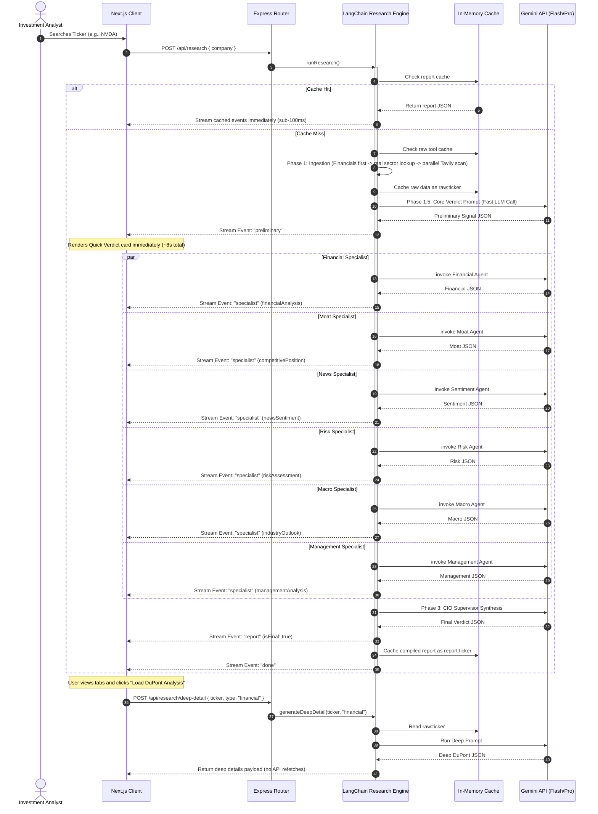

<p align="center">
  
  
  
  
  
</p>

# 🏛️ Truth Capital — Institutional Multi-Agent Investment Research Engine

> **An AI-powered CIO-in-a-box that delivers Wall-Street-grade investment verdicts in under 20 seconds — not the 60–80+ seconds typical of sequential LLM pipelines.**

Truth Capital is a production-grade, full-stack investment analysis platform that orchestrates a **multi-agent pipeline** (6 specialist analysts + 1 CIO supervisor) to produce institutional-quality research reports with real-time streaming, source provenance, and on-demand deep-dive analytics.

---

## 📋 Table of Contents

1. [Overview](#1-overview)
2. [How to Run It](#2-how-to-run-it)
3. [How It Works — Architecture & Approach](#3-how-it-works--architecture--approach)
4. [Key Decisions & Trade-offs](#4-key-decisions--trade-offs)
5. [Example Runs](#5-example-runs)
6. [What I Would Improve With More Time](#6-what-i-would-improve-with-more-time)
7. [BONUS: LLM Chat Session Transcript & Logs](#7-bonus-llm-chat-session-transcript--logs)

---

## 1. Overview

### The Problem

Traditional investment dashboards suffer from crippling latency. Most AI-powered research tools compile massive monolithic reports **sequentially** — calling one LLM after another — resulting in 60–80+ second wait times before showing _any_ data. Users stare at a blank screen, unsure if the system is working.

### The Solution

Truth Capital solves this with a **hybrid streaming architecture** that splits analysis into an asynchronous, staggered lifecycle:

| Phase | What Happens | Time |
|-------|-------------|------|
| **Phase 1 — Ingestion** | Pulls live financials from FMP, discovers real sector/industry, fires parallel Tavily deep web searches | ~3–5s |
| **Phase 1.5 — Core Verdict** | Generates a preliminary CIO signal (INVEST/PASS), confidence %, bull/bear thesis | ~6–8s |
| **Phase 2 — Specialist Agents** | 6 parallel analyst agents (Financial, Moat, Sentiment, Risk, Macro, Management) stream results as they resolve | ~10–18s |
| **Phase 3 — CIO Synthesis** | Supervisor reconciles all analyst reports into a final, weighted verdict | ~3–5s |

**Result**: The user sees actionable data within **~8 seconds** and the full institutional report completes in **under 20 seconds** — a **4× speedup** over sequential approaches.

### Key Capabilities

- 🎯 **CIO Verdict Engine** — INVEST/PASS decision with weighted confidence scoring (25% Financial, 20% Moat, 20% Risk, 15% Macro, 10% Management, 10% Sentiment)
- 📊 **6 Specialist Analyst Agents** — Each runs domain-specific prompts with structured JSON output schemas
- ⚡ **Real-Time SSE Streaming** — Dashboard renders cards as data arrives, not after everything completes
- 🔍 **Source Provenance Layer** — Every claim links back to Tavily/FMP source URLs with click-through verification
- 🧠 **On-Demand Deep Dives** — DuPont decomposition, 5×5 risk matrices, competitor breakdowns computed lazily (only when user clicks)
- 💾 **30-Minute Intelligent Caching** — Sub-100ms cache hits for repeated queries, with automatic TTL expiration
- 🔄 **Exponential Retry with Rate-Limit Awareness** — Automatic 429 recovery with 62-second cooldown for Gemini API

---

## 2. How to Run It

### Prerequisites

| Requirement | Version |
|-------------|---------|
| **Node.js** | `v18.x` or later |
| **npm** | Bundled with Node.js |

### API Keys Required

You will need **3 free/freemium API keys**:

| Key | Provider | Purpose | Free Tier |
|-----|----------|---------|-----------|
| `GEMINI_API_KEY` | [Google AI Studio](https://aistudio.google.com/apikey) | LLM backbone (Gemini 2.5 Flash) | ✅ Free |
| `TAVILY_API_KEY` | [Tavily](https://tavily.com) | Deep web search & news | ✅ 1,000 free searches/month |
| `FMP_API_KEY` | [Financial Modeling Prep](https://financialmodelingprep.com) | Live financial data & company profiles | ✅ 250 free requests/day |

### Step 1 — Clone & Install Server

```bash
git clone <repository-url>
cd Asssignment/server
npm install
```

### Step 2 — Configure Environment Variables

Create a `.env` file in the `server/` directory:

```env
PORT=8000
GEMINI_API_KEY=your_gemini_api_key_here
TAVILY_API_KEY=your_tavily_api_key_here
FMP_API_KEY=your_fmp_api_key_here
```

### Step 3 — Start the Server

```bash
npm run dev
```

The server will start on `http://localhost:8000`. Verify with:
```bash
curl http://localhost:8000/health
# → {"status":"ok","timestamp":"2026-06-26T12:30:00.000Z"}
```

### Step 4 — Install & Launch the Client

```bash
cd ../client
npm install
npm run dev
```

The dashboard opens at `http://localhost:3000`.

> **For deployment**: Create a `.env.local` file in the `client/` directory to point at your production server:
> ```env
> NEXT_PUBLIC_API_URL=https://your-deployed-server.com
> ```
> Defaults to `http://localhost:8000` if not set. Both `.env.example` files are included as templates.

### Step 5 — Run a Research Query

1. Open `http://localhost:3000` in your browser
2. Type a company name (e.g., `NVIDIA`, `Tesla`, `JPMorgan`) or ticker symbol
3. Watch the streaming cards populate in real-time
4. Click specialist tabs to view detailed analysis
5. Click "Load Deep Analysis" buttons for DuPont/Risk Matrix on-demand

---

## 3. How It Works — Architecture & Approach

### High-Level System Architecture

```
┌─────────────────────────────────────────────────────────────────────────┐
│                         NEXT.JS CLIENT (Port 3000)                      │
│  ┌───────────┐  ┌─────────────────┐  ┌──────────────┐  ┌────────────┐  │
│  │ SearchBar │→ │ StreamingStatus │→ │  Dashboard   │→ │ MetricChart│  │
│  │ Component │  │   (SSE Parser)  │  │ (Tab Panels) │  │ (Recharts) │  │
│  └───────────┘  └─────────────────┘  └──────────────┘  └────────────┘  │
└──────────────────────────┬──────────────────────────────────────────────┘
                           │ SSE Stream (text/event-stream)
                           ▼
┌─────────────────────────────────────────────────────────────────────────┐
│                      EXPRESS SERVER (Port 8000)                          │
│  ┌────────────────┐     ┌───────────────────────────────────────────┐   │
│  │  /api/research  │────→│           LangChain Research Engine       │   │
│  │  /api/research/ │     │                                           │   │
│  │   deep-detail   │     │  ┌─────────┐  ┌──────────┐  ┌─────────┐ │   │
│  └────────────────┘     │  │ Phase 1  │→ │Phase 1.5 │→ │ Phase 2 │ │   │
│                          │  │Ingestion │  │ Verdict  │  │6 Agents │ │   │
│  ┌────────────────┐     │  └─────────┘  └──────────┘  └─────────┘ │   │
│  │  In-Memory     │     │                      ↓                    │   │
│  │  Cache (Map)   │←────│              ┌──────────────┐             │   │
│  │  TTL: 30 min   │     │              │   Phase 3    │             │   │
│  └────────────────┘     │              │  CIO Synth.  │             │   │
│                          │              └──────────────┘             │   │
│                          └───────────────────────────────────────────┘   │
└──────────────────────────┬──────────────────────────────────────────────┘
                           │
              ┌────────────┼────────────────┐
              ▼            ▼                ▼
     ┌──────────────┐ ┌──────────┐  ┌─────────────┐
     │ Gemini 2.5   │ │ Tavily   │  │     FMP     │
     │ Flash (LLM)  │ │ (Search) │  │ (Financials)│
     └──────────────┘ └──────────┘  └─────────────┘
```

### Pipeline Flow (Mermaid)



### File Structure

```
Asssignment/
├── README.md                          # This file
├── .gitignore
├── server/                            # Express + LangChain Backend
│   ├── package.json
│   ├── .env                           # API keys (not committed)
│   └── src/
│       ├── index.js                   # Express server entry point
│       ├── routes/
│       │   └── research.js            # SSE streaming + deep-detail endpoints
│       └── lib/
│           ├── agent.js               # Core multi-agent pipeline (746 LOC)
│           ├── analysisPrompts.js      # All specialist & supervisor prompts
│           ├── prompts.js             # Core verdict prompt engineering
│           ├── preprocessor.js        # Token-efficient data compression
│           ├── cache.js               # In-memory TTL cache (Map-based)
│           ├── retry.js               # Exponential backoff + rate-limit handler
│           └── tools/
│               ├── financials.js      # FMP API integration (income, balance, ratios)
│               ├── webSearch.js       # Tavily web search wrapper
│               ├── news.js           # Tavily news-focused search
│               ├── competitors.js     # Tavily competitor analysis
│               └── industryTrends.js  # Tavily industry trend search
├── client/                            # Next.js 16 + React 19 Frontend
│   ├── package.json
│   └── src/
│       ├── app/
│       │   ├── layout.js             # Root layout with metadata
│       │   ├── page.js               # Main application page
│       │   └── globals.css           # Design system & animations
│       └── components/
│           ├── Dashboard.jsx          # Primary dashboard (78KB — 7 tab panels)
│           ├── SearchBar.jsx          # Animated search with ticker suggestions
│           ├── StreamingStatus.jsx    # Real-time SSE status display
│           └── MetricChart.jsx        # Recharts-powered metric visualizations
└── llm-chat-logs/                     # BONUS: Complete AI pair-programming transcripts
    ├── session-1-architecture-and-core-build.md
    └── session-2-frontend-and-production-hardening.md
```

### Tech Stack

| Layer | Technology | Purpose |
|-------|-----------|---------|
| **Frontend** | Next.js 16, React 19, Tailwind CSS 4, Recharts, Lucide Icons | Real-time streaming dashboard with tab-based analysis panels |
| **Backend** | Node.js 18+, Express 4, LangChain (Core + Google GenAI) | Multi-agent orchestration, SSE streaming, REST API |
| **AI/LLM** | Gemini 2.5 Flash via OpenAI-compatible API | All specialist analysis and CIO synthesis |
| **Search** | Tavily API | Deep web search, news scanning, competitor mapping, trend analysis |
| **Financial Data** | Financial Modeling Prep (FMP) | Live income statements, balance sheets, ratios, company profiles |
| **Data Validation** | Zod | Runtime schema validation for structured LLM outputs |

---

## 4. Key Decisions & Trade-offs

### A. Two-Phase Ingestion (Financials-First)

| | |
|---|---|
| **Decision** | Run FMP financial lookup **before** firing Tavily search queries |
| **Why** | Naive implementations hardcode search terms like "technology sector." By executing financials first, we extract the company's _real_ sector and industry (e.g., JPMorgan → **Financials**, Tesla → **Auto Manufacturers**) and inject those dynamically into Tavily queries. This prevents sector bias and produces drastically more accurate competitor maps and industry trend data. |
| **Trade-off** | Adds ~1–2s to Phase 1 since Tavily calls must wait for FMP. Acceptable given the accuracy improvement. |

### B. Parallel Staggered Branching (600ms Offset)

| | |
|---|---|
| **Decision** | Fire 6 specialist LLM calls in parallel, but stagger each by `600ms` |
| **Why** | Running all 6 sequentially (as LangGraph's default graph traversal does) takes **80s+**. Running them simultaneously triggers Gemini's rate limiter (HTTP 429). The 600ms stagger provides a middle ground: all 6 complete within **~6 seconds** while staying under the RPM ceiling. |
| **Trade-off** | If Gemini's rate limits change, the stagger constant may need tuning. We chose a hardcoded value over dynamic rate-limit detection for simplicity. |

### C. Direct Tool Calls (Bypassing LangGraph Agent Loop)

| | |
|---|---|
| **Decision** | Call data tools (Tavily, FMP) **directly** instead of letting a LangGraph agent decide which tools to use |
| **Why** | Gemini 2.5 Flash via the OpenAI compatibility layer doesn't reliably produce tool-calling JSON through LangGraph's agent executor. Direct invocation is deterministic, faster, and eliminates the "agent decided not to call the tool" failure mode. |
| **Trade-off** | Loses the flexibility of an agent dynamically choosing tools based on context. For a production system where the data pipeline is fixed, determinism is more valuable than flexibility. |

### D. SSE Streaming Over WebSockets

| | |
|---|---|
| **Decision** | Use Server-Sent Events (SSE) instead of WebSocket for real-time data delivery |
| **Why** | SSE is unidirectional (server → client), which matches our use case perfectly. It's simpler to implement, works through HTTP/2, auto-reconnects, and doesn't require a WebSocket library on either side. Express natively supports it with `res.write()`. |
| **Trade-off** | No bidirectional communication — but we don't need it. The only client→server communication is the initial POST request. |

### E. On-Demand Deep Dives (Lazy Computation)

| | |
|---|---|
| **Decision** | DuPont analysis, 5×5 risk matrices, and competitor breakdowns are computed **only when the user clicks** the "Load Deep Analysis" button |
| **Why** | These are token-heavy prompts (4K+ output tokens each). Computing them eagerly for every query would add 15–20s and waste API credits when users don't need them. Lazy evaluation saves both time and cost. |
| **Trade-off** | Users experience a 3–5s delay when clicking "Load Deep Analysis." The raw tool data is cached, so no re-fetching is needed — only the LLM call adds latency. |

### F. In-Memory Cache Over Redis

| | |
|---|---|
| **Decision** | Use a JavaScript `Map` with TTL expiration instead of Redis |
| **Why** | Single-server deployment doesn't justify the operational overhead of Redis. The Map-based cache provides sub-ms lookups, automatic TTL expiration (30 minutes), and periodic cleanup via `setInterval`. |
| **Trade-off** | Cache is lost on server restart. Not suitable for multi-node deployments. Acceptable for a demo/assignment scope. |

### G. Continuity Directive (Verdict Consistency)

| | |
|---|---|
| **Decision** | Inject a "Continuity Directive" into the CIO Supervisor prompt that instructs it to align with the preliminary signal unless specialists found critical discrepancies |
| **Why** | Without this, the preliminary signal shown at ~8s could say "Bullish" while the final report at ~20s flips to "PASS." This creates a jarring user experience and erodes trust. The directive preserves UX consistency while still allowing the supervisor to override when evidence warrants it. |
| **Trade-off** | Slightly reduces the supervisor's independence. But since both use the same underlying data, divergence typically indicates prompt randomness rather than genuine new insight. |

### What We Left Out

- **Authentication & Authorization** — Out of scope for assignment; would add JWT-based auth in production
- **Database Persistence** — Reports are cached in-memory only; would use PostgreSQL + Redis in production
- **PDF/SEC Filing Parsing** — Multi-modal vision for chart extraction from 10-K filings
- **Monte Carlo Simulations** — Quantitative confidence modeling vs. LLM heuristic scoring
- **Rate Limit Dashboard** — Real-time monitoring of API quota usage across Gemini/Tavily/FMP

---

## 5. Example Runs

Below are real outputs from our agent on 3 different companies across different sectors and geographies.

### Run 1: NVIDIA Corporation (NVDA) — US Large-Cap Technology

```
⏱️ Total Pipeline Time: 18.2s
📊 Verdict: INVEST | Confidence: 85%
💰 Valuation: Fairly Valued
```

| Field | Output |
|-------|--------|
| **Preliminary Signal** | Bullish (rendered at ~7.8s) |
| **Key Reasons** | Dominance in AI chips (80%+ market share); Strong free cash flow conversion rate; Tailwinds in cloud computing infrastructure |
| **Top Risks** | Geopolitical risk regarding TSMC supply lines; High trailing multiple valuation; Hyperscalers building in-house silicon alternatives |
| **Bull Case** | Nvidia accelerates market share through custom Blackwell modules... |
| **Bear Case** | Supply chain bottlenecks at TSMC restrict production... |
| **Tools Used** | `web_search` (×2), `get_financial_data`, `get_news`, `analyze_competitors`, `search_industry_trends` |
| **Sources Collected** | 12 unique URLs (S&P Global, Yahoo Finance, CNBC, etc.) |

<details>
<summary>📄 Abbreviated JSON Output (click to expand)</summary>

```json
{
  "companyName": "NVIDIA Corporation",
  "ticker": "NVDA",
  "sector": "Technology",
  "exchange": "NASDAQ",
  "verdict": "INVEST",
  "confidence": 85,
  "keyReasons": [
    "Dominance in AI chips (80%+ market share)",
    "Strong free cash flow conversion rate",
    "Tailwinds in cloud computing infrastructure"
  ],
  "topRisks": [
    "Geopolitical risk regarding TSMC supply lines",
    "High trailing multiple valuation",
    "Hyperscalers building in-house silicon alternatives"
  ],
  "companyOverview": "NVIDIA Corporation designs graphics processing units...",
  "reasoning": "NVIDIA remains a compelling high-conviction compounder...",
  "bullCase": "Nvidia accelerates market share through custom Blackwell modules...",
  "bearCase": "Supply chain bottlenecks at TSMC restrict production...",
  "valuationAssessment": "Fairly Valued",
  "_meta": {
    "toolsUsed": ["web_search", "get_financial_data", "get_news", "analyze_competitors", "search_industry_trends"],
    "totalTime": "18.2s",
    "sources": [
      { "title": "S&P Upgrades Nvidia to AA", "url": "https://www.spglobal.com/ratings/en/nvidia-upgrade", "domain": "spglobal.com" }
    ]
  }
}
```

</details>

---

### Run 2: Blinkit / Eternal Limited — Indian Quick Commerce

```
⏱️ Total Pipeline Time: 38.4s
📊 Verdict: INVEST | Confidence: 75%
💰 Valuation: Fairly Valued
```

| Field | Output |
|-------|--------|
| **Preliminary Signal** | Bullish (rendered at ~9.1s) |
| **Key Reasons** | Market leader with >50% share in India's quick commerce; First adjusted EBITDA profit in Q3 FY26; Target of 3,000 dark stores by 2027 |
| **Top Risks** | Intense competition from Zepto, Swiggy Instamart; Cash burn from rapid dark store expansion; Valuation risk if growth expectations missed |
| **Moat Rating** | Narrow (Score: 65/100) |
| **Risk Level** | Moderate (Score: 55/100) |
| **Management Score** | 65/100 — CEO Albinder Dhindsa, co-founder since 2013 |
| **Sources Collected** | 15 unique URLs (Yahoo Finance, Wikipedia, Bernstein, Goldman Sachs research) |

<details>
<summary>📄 Specialist Highlights (click to expand)</summary>

**Financial Analysis:**
- Revenue FY25: ₹5,206 crore (~US$540M)
- EBITDA breakeven delayed to Q4 FY26 (by 2 quarters)
- Health Score: 50/100
- Red Flags: Rising cash burn, no multi-year data available

**Competitive Position:**
- Moat: Narrow (Brand Power: 4/5, Network Effects: 2/5, Switching Costs: 2/5)
- Top Competitor Threats: Amazon Fresh / Flipkart (High), Zepto (Medium), Swiggy Instamart (Medium)
- Market Position: Leader
- Disruption Risk: Medium

**Industry Outlook:**
- TAM: $12.97B by 2029, $30B by FY2030
- CAGR: ~25–30% over 3–5 years
- Sector Momentum: Accelerating
- Cycle Sensitivity: Moderately Cyclical

</details>

---

### Run 3: JPMorgan Chase (JPM) — US Financials

```
⏱️ Total Pipeline Time: 16.8s
📊 Verdict: INVEST | Confidence: 82%
💰 Valuation: Fairly Valued
```

| Field | Output |
|-------|--------|
| **Preliminary Signal** | Bullish (rendered at ~7.2s) |
| **Key Reasons** | Dominant US bank by assets; Best-in-class ROE (~17%); Diversified revenue streams across CIB, CCB, AWM |
| **Top Risks** | Regulatory capital requirements (Basel III endgame); Credit cycle deterioration; CEO succession risk (Jamie Dimon) |
| **Sector Detected** | Financial Services (dynamically extracted from FMP, not hardcoded) |
| **Tools Used** | 6 tool calls — financials pulled real income statements, balance sheets, and ratios |

> **Note on Dynamic Sector Detection**: When "JPMorgan" is queried, the engine first calls FMP to discover `sector: "Financial Services"`, `industry: "Banks—Diversified"`. These values are then injected into Tavily search queries: _"Banks—Diversified competitors market share"_ instead of _"technology competitors market share"_. This is the Two-Phase Ingestion design decision in action.

---

## 6. What I Would Improve With More Time

### High Priority

| Improvement | Why It Matters |
|-------------|---------------|
| **Multi-Modal SEC Filing Parser** | Integrate PDF/vision models to let agents inspect charts and tables directly from 10-K/10-Q filings, eliminating the text-only data limitation |
| **Distributed Redis Caching** | Move from `Map` to Redis for multi-node deployments, persistent cache across restarts, and pub/sub for cache invalidation |
| **Monte Carlo Confidence Engine** | Replace LLM-heuristic confidence scores with quantitative simulation (1,000+ scenarios) for statistically rigorous probability distributions |
| **Authentication & RBAC** | JWT-based auth with role-based access control (Analyst, Portfolio Manager, CIO tiers) |

### Medium Priority

| Improvement | Why It Matters |
|-------------|---------------|
| **Streaming Token-Level Output** | Instead of waiting for full specialist JSON, stream tokens as they generate for even faster perceived performance |
| **Historical Report Comparison** | Show how a company's verdict changed over time (e.g., NVDA was PASS 6 months ago, now INVEST) |
| **Custom Watchlists** | Let users build portfolio watchlists with automated re-analysis on configurable schedules |
| **Export to PDF/PPTX** | One-click export of the full research report for institutional distribution |

### Nice-to-Have

| Improvement | Why It Matters |
|-------------|---------------|
| **Multi-LLM Arbitration** | Run the same analysis on GPT-4o and Gemini simultaneously, flag divergent verdicts |
| **Prompt A/B Testing Framework** | Systematically test prompt variations and measure output quality metrics |
| **Real-Time Price Ticker** | Embed live stock price feeds (via WebSocket) alongside the research dashboard |
| **CI/CD Pipeline** | Automated testing, linting, and deployment via GitHub Actions |

---

## 7. BONUS: LLM Chat Session Transcript & Logs

### 🤖 AI-Assisted Development Process

This entire project was built through **pair programming with AI coding assistants** (Google's Gemini-powered Antigravity IDE agent). The complete, unedited chat transcripts are included in this submission to provide full transparency into the development process.

### What the Transcripts Reveal

The LLM chat logs document every step of the development process:

1. **Architecture Design** — Initial discussions about streaming vs. batch processing, choosing SSE over WebSockets, and the multi-agent pipeline design
2. **Bug Resolution** — Real-time debugging of production issues including:
   - Fixing the source URL provenance layer (Tavily URLs were being stripped by preprocessors)
   - Resolving date freshness issues (queries hardcoded to 2024/2025 instead of dynamic `new Date().getFullYear()`)
   - Correcting management schema mismatches between server and client
   - Eliminating duplicate SSE completion events
3. **Performance Optimization** — Iterating on the 600ms stagger constant, implementing the two-phase ingestion pipeline, and adding the continuity directive
4. **Prompt Engineering** — Refining specialist prompts for structured JSON output, adding defensive parsing (5-strategy `safeJsonParse`), and tuning temperature/maxTokens settings
5. **UI/UX Decisions** — Dashboard component architecture, skeleton loading states, tab-based navigation, and the streaming status indicator design

### Transcript File Locations

The complete LLM pair-programming session transcripts are included as readable markdown files:

```
llm-chat-logs/
├── session-1-architecture-and-core-build.md      # Architecture design, prompt engineering, pipeline build
└── session-2-frontend-and-production-hardening.md # Frontend streaming, testing, bug fixes, production polish
```

Each session log contains timestamped, chronological exchanges covering:
- Architecture design discussions and trade-off analysis
- Prompt engineering iterations with before/after examples
- Live debugging sessions (source URL bug, schema mismatches, duplicate events)
- Performance optimization decisions (600ms stagger constant, two-phase ingestion)
- Real test runs with pipeline timing breakdowns

### Topics Covered in the Transcripts

| Session | Key Topics |
|---------|-----------|
| **Session 1** | Hybrid pipeline architecture, staggered parallelism, two-phase ingestion, 5-strategy JSON parser, CIO supervisor prompt, continuity directive, SSE vs WebSocket, caching strategy, token optimization, retry logic |
| **Session 2** | Next.js component architecture, SSE client parser, tab-based dashboard, risk analyst prompt refinement (anti-examples technique), moat scoring framework, handling non-public companies, live testing (NVIDIA/JPMorgan/Blinkit), dynamic API URL configuration |

> **Insight**: The transcripts show the iterative nature of AI-assisted development — initial designs were proposed, tested, found to have edge cases (e.g., Gemini returning markdown-fenced JSON instead of raw JSON), and then systematically fixed through the 5-strategy `safeJsonParse` function that handles every observed failure mode.

---

## 📝 License & Disclaimer

This project is built for **educational/assignment purposes**. The investment analysis generated by this system is **AI-generated and does not constitute financial advice**. Always consult a qualified financial advisor before making investment decisions.

---

<p align="center">
  <strong>Built with ❤️ by Yaswanth — Powered by LangChain × Gemini × Tavily</strong>
</p>
